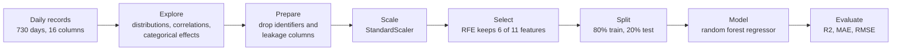

# Bike Sharing Demand Prediction

Predicts how many bikes a sharing service will rent on a given day from weather, season and calendar information. A random forest on six selected features explains about 90% of the variance in daily demand.

`Python` `scikit-learn` `pandas` `NumPy` `Matplotlib` `seaborn`

## Why this exists

A bike sharing operator has to decide every day how many bikes to put where. Demand swings with temperature, season and whether it is a working day, so a forecast built on those signals turns a guess into a plan.

## Pipeline



| Step | Detail |
| --- | --- |
| Target | `cnt`, the total number of rentals in a day |
| Inputs | Season, year, month, holiday, weekday, working day, weather situation, temperature, feels-like temperature, humidity, wind speed |
| Dropped | `instant` and `dteday` (identifiers), and `casual` and `registered`, which add up to the target and would leak it |
| Exploration | Correlation heatmaps, pair plots and box plots, and dummy encoding of the categorical columns (season, month, weekday, weather) |
| Feature selection | Recursive feature elimination with a random forest as the estimator, keeping 6 features |
| Model | `RandomForestRegressor` with a fixed random seed |

Dropping `casual` and `registered` is the decision that matters most. Together they sum to `cnt`, so a model given either one would look excellent and predict nothing.

## Results

On the held-out 20%:

| Metric | Value |
| --- | ---: |
| R2 | 0.899 |
| MAE | 463 rentals per day |
| RMSE | 587 rentals per day |

## Running it

```bash
pip install pandas numpy scikit-learn matplotlib seaborn jupyter
jupyter notebook "Bike_sharing_demand_prediction(2) .ipynb"
```

The notebook reads `day.csv` from its own folder. The dataset is not included in the repository.

## Limitations and next steps

- Scaling and feature selection are fitted on the full dataset before the split. Fitting them on the training data only, inside a scikit-learn `Pipeline`, would remove that small leak.
- The split is random, although the data is a time series. Training on the first year and testing on the following months would measure forecasting ability more honestly.
- The forest runs with default hyperparameters. A search over depth and the number of trees, with cross-validation, is the next step.
- Lagged demand, such as yesterday's and last week's count, is likely to be a strong feature and is not used yet.

---

Built by [Yogdeep Benchimath](https://github.com/Yogdeep2004). More work on the [portfolio](https://deepwork-systems.vercel.app/).
